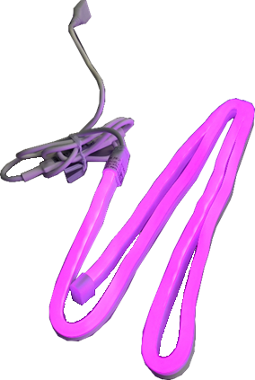

# MINI ARCADE

Dokumentation zum Bau einer Retro-Spielekonsole

## Inhalt

1. [Einleitung](#1-einleitung)
2. [Hardware & Material](#2-hardware--material)
	1. [Raspberry Pi 4B](#21-raspberry-pi-4b)
	2. [7 Zoll Monitor](#22-7-zoll-monitor)
	3. [Lautsprecher](#23-lautsprecher)
	4. [LED-Streifen](#24-led-streifen)
	5. [Netzteil](#25-netzteil)
	6. [USB-Hub](#26-usb-hub)
	7. [Gamepad](#27-gamepad)
	8. [Zusätzliche Kabel](#28-zusätzliche-kabel)
	9. [MicroSD-Karte](#29-microsd-karte)
	10. [PLA-Filament](#210-pla-filament)
	11. [Plexiglas](#211-plexiglas)
	12. [Schrauben](#212-schrauben)
3. [Betriebssystem & Software](#3-betriebssystem--software)
4. [Verwendete Geräte](#4-verwendete-geräte)
	1. [3D-Druck](#41-3d-druck)
	2. [Laserschneiden](#42-laserschneiden)
	3. [Optional: Bedrucken der Frontplatte](#43-optional-bedrucken-der-frontplatte)
5. [Zusammenbau](#5-zusammenbau)

## 1. Einleitung

Retro-Games haben einen besonderen Charme. Sie versetzen uns zurück in die Ära der 8-Bit- und 16-Bit-Spiele, als Pixelgrafiken und einfache Soundeffekte der Stand der Technik waren. Mit moderner Technologie können wir diese Nostalgie wieder zum Leben erwecken und Spieleklassiker von damals auf einer selbstgebauten Konsole genießen.

In dieser Dokumentation nehmen wir dich mit auf eine spannende Reise, bei der wir Schritt für Schritt den Bau einer eigenen Retro-Spielekonsole mit einem Raspberry Pi und Batocera OS durchführen.

Der Raspberry Pi ist ein vielseitiger Einplatinencomputer, der sich hervorragend für Retro-Gaming-Projekte eignet. Er ist kostengünstig, energieeffizient und bietet genügend Rechenleistung, um Emulatoren für verschiedene Konsolen zu betreiben.

Statt des bekannten RetroPie entschieden wir uns für Batocera OS, eine Alternative, die uns mit ihrer Benutzerfreundlichkeit und Stabilität überzeugte. Batocera ist ein open-source Betriebssystem, das speziell für Retro-Gaming entwickelt wurde.

Besonders wichtig ist bei so einem Projekt das Design. Das Gehäusedesign ist angelehnt an den Stil einer klassischen Arcade-Maschine, jedoch in einem kleineren Format. Dafür werden verschiedene Techniken wie 3D-Druck, Lasercutten oder auch UV-Druck verwendet. Im Rahmen des Nachbaus werden verschiedenste Kenntnisse im Bereich der IT, Fertigungstechnik und auch Planung vermittelt.

## 2. Hardware & Material

Die verwendete Hardware ist hier gelistet und wird im Anschluss genauer erläutert:

- Raspberry Pi 4B (4GB RAM)
- 7 Zoll Monitor für Raspberry Pi mit HDMI-Anschluss und Micro-USB Power
- HDMI-Adapter gewinkelt
- PC-Lautsprecher 6W
- LED-Streifen mit USB-Stromversorgung
- Netzteil mit USB-B und USB-C Ausgang
- USB-Hub
- 2x Gamepad
- HDMI zu Micro-HDMI Kabel
- USB-C zu USB-C Kabel 0,50m
- USB-A zu Micro-USB Kabel 0,50m
- USB-Hub
- MicroSD-Karte 16GB
- 18x M3x10 Schrauben
- 12x M3 Muttern
- 8x M2,5x12 Schrauben
- 4x M2x6 Schrauben
- 4x Abstandshalter 2,5
- PLA-Filament für 3D-Drucker
- Plexiglas 2mm transparent
- Plexiglas 3mm weiß

### 2.1 Raspberry Pi 4B

Abbildung 1: Raspberry Pi 4B

Der Raspberry Pi 4B ist ein Einplatinencomputer, der von der Raspberry Pi Foundation entwickelt wurde. Er ist mit einem Quad-Core-Prozessor von Broadcom ausgestattet, der mit einer Taktfrequenz von 1,5GHz arbeitet. Verschiedenen Varianten sind erhältlich, welche sich in der Größe des Arbeitsspeichers unterscheiden. Die verwendete Variante verfügt über 4GB RAM.
Dieser vielseitige Computer kann als Desktop-Computer, Medienzentrum, Webserver, IoT-Gerät und vieles mehr verwendet werden. Er verfügt über 2 USB-3.0-Anschlüsse, 2 USB-2.0-Anschlüsse, 2 Micro-HDMI-Anschlüsse, Gigabit-Ethernet und WLAN.
Der Stromverbrauch des Raspberry Pi 4B liegt unter 15W.
Der Raspberry Pi 4B ist ein leistungsstarker Computer, der für viele Anwendungen geeignet ist. Er ist auch sehr erschwinglich und kann für weniger als 55€ erworben werden (Stand: April 2024).
[Raspberry Pi® 4B 4 GB](https://www.conrad.de/de/p/raspberry-pi-4-b-4-gb-4-x-1-5-ghz-raspberry-pi-2138865.html)

Alternativ können auch andere Single-Board-Computer (SBC) verwendet werden. Dabei sollte darauf geachtet werden, dass diese auch kompatibel mit dem genutzten Betriebssystem ist.
Auf [batocera.linux](https://batocera.org/) ist eine Liste mit unterstützter Hardware zu finden.

### 2.2 7 Zoll Monitor

Abbildung 2: 7 Zoll Monitor (vorne, hinten)

Als Bildschirm wird ein 7 Zoll LC-Display verwendet, welches einen HDMI-Eingang besitzt und etwa 0,9A Strom bei einer Spannung von 5V über einen Micro-USB Eingang bezieht. Der Stromverbrauch liegt also unter 5W. Das genutzte Modell hat eine Auflösung von 800x480 Pixel und ist auf Conrad für circa 75€ erhältlich:
[TRU COMPONENTS 7 Zoll Monitor 800 x 480](https://www.conrad.de/de/p/tru-components-touchscreen-modul-17-8-cm-7-zoll-800-x-480-pixel-passend-fuer-entwicklungskits-raspberry-pi-banana-2147389.html?hk=SEM&+Education=&+Education=&B2C+Experience=&ef_id=15caf7132b1d1d09ad2592b223a6ad7e%3AG%3As&s_kwcid=AL%21222%2110%2172155731682865%214575755098895001&msclkid=15caf7132b1d1d09ad2592b223a6ad7e&utm_source=bing&utm_medium=cpc&utm_campaign=Education+%26+Entwicklungskits&utm_term=4575755098895001&utm_content=Education+%26+Entwicklungskits#productTechData)

Jedoch gibt es Modelle mit identischer Bauart, die bei gleichem Stromverbrauch eine Auflösung von 1024x600 Pixel bieten und zudem günstiger sind:
[Waveshare 7inch LCD 1024x600](https://www.conrad.de/de/p/waveshare-7inch-capacitive-touchscreen-lcd-display-1024x600-hdmi-for-raspberry-pi-windows-802231390.html)

Das empfohlene Alternativgerät kostet (Stand: April 2024) ca. 60€.

Da der HDMI-Eingang seitlich angebracht ist und das Gehäuse recht kompakt ist, ist ein gewinkelter HDMI-Adapter, der für ca. 5€ erhältlich ist, in Verwendung:
[HDMI Adapter gewinkelt](https://www.conrad.de/de/p/hdmi-adapter-1x-hdmi-stecker-1x-hdmi-buchse-270-nach-oben-gewinkelt-vergoldete-steckkontakte-speaka-professional-1967532.html?searchType=SearchRedirect)

### 2.3 Lautsprecher

Abbildung 3: PC-Lautsprecher 6W

Die verwendeten Lautsprecher haben eine Eingangsleistung von 6W und haben zwei Konnektoren. Ein USB-Anschluss zur Stromversorgung und einen 3,5mm-Klinkenstecker zur Audioübertragung. Gewählt wurden diese Lautsprecher vorwiegend wegen der kompakten Bauart.
Auf conrad.de sind sie für 8€ erhältlich (Stand: April 2024):
[Renkforce PC-Lautsprecher 6 W](https://www.conrad.de/de/p/renkforce-rf-4755736-pc-lautsprecher-kabelgebunden-6-w-schwarz-2377868.html)

### 2.4 LED-Streifen

Abbildung 4: Paulmann LED-Streifen

Da Optik ein wesentlicher Bestandteil dieser Spielekonsole ist, ist auch eine RGB-Multicolor LED mit Farbwechsel eingebaut. Diese wird über USB-A mit einer Leistung von 5W betrieben.
Das benutzte Modell ist ein flexibler Streifen der Länge 1m von Paulmann und kostet 14€ auf conrad.de (Stand: April 2024):
[Paulmann LED-Streifen](https://www.conrad.de/de/p/paulmann-paulmann-70557-led-streifen-mit-usb-anschluss-5-v-1-m-1-st-2372725.html?searchType=SearchRedirect)

### 2.5 Netzteil

Abbildung 5: 38W Netzteil von Varta

Die bisherigen Geräte nehmen ca. eine Leistung von 31W auf. Demnach muss unser Netzteil auch mindestens 31W liefern können. Hier wurde sich für ein 38W Modell von Varta entschieden, wobei sich die Ausgangsleistung aufteilt in 20W über den USB-C-Ausgang und 18W über den USB-A-Ausgang. Das Netzteil kostet 19€ auf conrad.de (Stand: April 2024):
[Varta Speed Charger 38 W](https://www.conrad.de/de/p/varta-speed-charger-38-w-usb-ladegeraet-38-w-steckdose-anzahl-ausgaenge-2-x-usb-usb-c-2799384.html)

### 2.6 USB-Hub

Abbildung 6: Renkforce 4 Port USB-Hub

Um den Strom auf die einzelnen Komponenten aufzuteilen, wird ein kompaktes USB-Hub verwendet. Mit vier USB-A Ports ist auch eine gewisse Flexibilität gewährleistet, um für mögliche Erweiterungen keine Neuanschaffung zu erfordern. Das verwendete Hub kostet 18€ auf conrad.de (Stand: April 2024):
[Renkforce 4 Port USB 3.0-Hub](https://www.conrad.de/de/p/renkforce-4-port-usb-3-2-gen-1-hub-usb-3-0-aluminium-1234385.html?searchType=SearchRedirect)

Eine etwas günstigere Alternative für 9€ findet man unter folgendem Link:
[Conceptronic 4 Port USB 2.0-Hub](https://www.conrad.de/de/p/conceptronic-hubbies05b-4-port-usb-2-0-hub-schwarz-2896158.html)

### 2.7 Gamepad

Abbildung 7: Retro-Controller mit USB-Anschluss

Die verwendeten Controller werden per USB an den Raspberry Pi angeschlossen, benötigen keine Einrichtung und sind im klassischen Look einer alten SNES-Konsole. Das Stück kostet 5€ auf conrad.de:
[Joy-it Gamepad SNES Design](https://www.conrad.de/de/p/joy-it-gamepad-snes-design-gamepad-raspberry-pi-universal-grau-1954771.html?searchType=SearchRedirect)

### 2.8 Zusätzliche Kabel

   

Abbildung 8: HDMI zu MicroHDMI Kabel, USB-C zu USB-C Kabel, USB-A zu MicroUSB Kabel (von links nach rechts)

Zusätzlich werden die abgebildeten Standardkabel genutzt. Die beiden USB-Kabel werden für die Stromversorgung verwendet, das HDMI-Kabel zum Verbinden von Raspberry Pi und Bildschirm. Alle Kabel benötigen jeweils eine Länge von weniger als 50 cm.

### 2.9 MicroSD-Karte

Abbildung 9: Intenso MicroSD 16GB

Als Speichereinheit benutzt das Raspberry Pi eine MicroSD Karte. Das Batocera-Betriebssystem nimmt etwa 5GB in Anspruch. In Verwendung ist eine Intenso 16GB MicroSD, die mit einem Adapter geliefert wird und ca. 5€ kostet.
[Intenso 16GB microSDHC](https://www.conrad.de/de/p/intenso-16gb-microsdhc-performance-microsd-karte-16-gb-class-10-uhs-i-wasserdicht-2859939.html?searchType=SearchRedirect)

Man muss beachten, dass man, um das Betriebssystem auf das Speichergerät zu flashen, die SD-Karte mit einem PC verbinden muss. Es sollte also darauf geachtet werden, dass der PC über eine SD-Karten Schnittstelle verfügt oder ein geeigneter Adapter verwendet werden kann.

### 2.10 PLA-Filament

ESUN RF-5271434 Filament PLA flexibel 1.75 mm 1 kg Rot-Blau, Glanzeffekt kaufen (conrad.de)
Für die 3D-gedruckten Teile wurde im Beispiel mehrfarbiges PLA der Marke ESUN verwendet, allerdings können auch andere Materialien, Marken und Farben verwendet werden, solange das Filament einen Durchmesser von 1,75mm hat. PLA eignet sich gut für Anfänger, da sich das Material besonders leicht verarbeiten lässt. Für Fortgeschrittene wäre auch die Verwendung von PETG oder ABS denkbar. Insgesamt werden ungefähr 500 Gramm Material benötigt.

### 2.11 Plexiglas

Für die Rückenplatte, die Klappe und die Platte, auf der der Raspberry Pi befestigt ist, wurde 2 mm dickes, durchsichtiges Plexiglas verwendet. Für die Frontplatte wurde 3 mm dickes, weißes Plexiglas verwendet. In der Werkstatt stehen Plexiglasscheiben in diversen Größen und Stärken zur Verfügung, daher muss kein Material bestellt werden. Es konnten größtenteils Reste verwendet werden. 
Falls kein Lasercutter zur Verfügung steht, können die Teile stattdessen auch 3D-gedruckt werden.

### 2.12 Schrauben

- 14x M3x10 Schrauben, 4x M3 Muttern, 4x M3x8 Abstandshalter
- 16x M2,5x12 Schrauben, 16x M2,5 Muttern

Es können auch andere Schrauben verwendet werden. Vor allem die Länge kann variabel sein, da man Überhänge kaum sieht. Beim Verwenden anderer Dicke muss darauf geachtet werden, dass man die Änderungen auch im Gehäuse berücksichtigt.

## 3. Betriebssystem & Software

Das Open-Source Betriebssystem Batocera ist eine für Retrospiele optimierte Linux Distribution, welche auf [batocera.linux](https://batocera.org/) kostenlos verfügbar ist. Es ist darauf zu achten, die richtige Version auszuwählen. In unserem Fall ist dies die des Raspberry Pi 4B. Für die folgenden Arbeitsschritte benötigen wir einen separaten PC, an welchen wir eine SD-Karte anschließen können.

Abbildung 10: Download des Betriebssystems

Die Datei wird im komprimierten gz-Format heruntergeladen, was bedeutet, dass wir die Datei nach dem Download noch entpacken müssen. Dafür benutzen wir das Open-Source Tool 7-Zip. [7-zip Download](https://www.7-zip.org/download.html)

Abbildung 11: Download Bereich der 7-zip Website

Das Entpacken erfolgt durch einfachen Rechtsklick auf die Datei.

Abbildung 12: Entpacken der gz-Datei

Zudem benötigen wir einen sogenannten MD_Images/imager, um das Betriebssystem auf die SD-Karte zu schreiben. Dafür können alle bekannten MD_Images/imager-Programme wie Rufus, AnyBurn oder balenaEtcher verwendet werden. Wir entscheiden uns hier im Beispiel für den Raspberry Pi MD_Images/imager, da wir ja auch einen Raspberry Pi verwenden. [Raspberry Pi Software](https://www.raspberrypi.com/software/)

Abbildung 13: Downloadseite des Raspberry Pi MD_Images/imagers

Die heruntergeladene Datei ist eine .exe, welche einfach ausgeführt werden muss. Bei der Installation ist nichts Besonderes zu beachten.

Durch das Starten des MD_Images/imagers gelangt man in folgendes Fenster.

Abbildung 14: Startseite des Raspberry Pi MD_Images/imagers

Wählen sie ihr Raspberry Pi Modell und ihre verbundene SD-Karte aus. Unter dem Reiter Betriebssystem klicken sie für Batocera auf Use custom und wählen danach ihre entpackte .img Datei von Batocera aus.

Abbildung 15: Auswahl des Betriebssystems im MD_Images/imager

Drücken sie auf weiter und warten den Schreibvorgang ab. Die SD-Karte kann anschließend in den Raspberry Pi eingesetzt werden.

## 4. Verwendete Geräte

- 3D Drucker
- Lasercutter
- UV-LED Drucker (optional)

**Wichtig:** Die Maschinen dürfen nur nach Einweisung und nur unter Aufsicht verwendet werden!

### 4.1 3D-Druck

 

  
Das Gehäuse der Mini-Arcade hat drei Hauptbestandteile, die später mit Schrauben verbunden werden. Das gesamte Modell wurde mit der Software Fusion360 erstellt. Die Software steht für die private Nutzung kostenlos zur Verfügung.

Folgende Dateien werden benötigt:
Mini_Arcade_Gehäuse_oben.stl
Mini_Arcade_Gehäuse_mitte.stl
Mini_Arcade_Gehäuse_unten.stl
Mini_Arcade_Scharnier_L.stl
Mini_Arcade_Scharnier_R.stl

Das obere Teil enthält später den LED-Streifen. Es ist nach unten hin offen, sodass das USB-Kabel durchgeführt werden kann. Vorne befinden sich Schraublöcher, sodass später die Plexiglas-Frontplatte darauf geschraubt werden kann.
Das mittlere Teil hat ein Loch in der Oberseite, um das USB-Kabel des LED-Streifens durchzuführen. Zudem gibt es innen vier Schraublöcher, an denen der Bildschirm und der Raspberry Pi befestigt werden, und weitere Schraublöcher an denen die Rückenplatte befestigt wird.
Auch das untere Teil hat Schraublöcher für die Rückenplatte. Nach außen hat es auf beiden Seiten einige Löcher, sodass der Ton der Lautsprecher besser hörbar ist. Zwei Halterungen auf der Innenseite sorgen dafür, dass die Lautsprecher nicht verrutschen. Durch ein größeres Loch in der Mitte können später die Kabel der Controller geführt werden. Im vorderen Bereich gibt es rechts und links jeweils ein Loch in denen später die Scharniere sitzen, mithilfe derer die vordere Klappe bewegt werden kann.

Die Grundlagen zur Verwendung des 3D-Druckers sind im Moodle Kurs “3D-Druck” erklärt. Der Kurs sollte vor dem Beginn des Arbeitens mit dem 3D-Drucker bearbeitet werden.
Das Modell ist in drei Teile unterteilt, da das Modell im Ganzen zu groß für das Druckvolumen des 3D-Druckers wäre und weil sich so Überhänge weitestgehend vermeiden lassen.
Das untere und das mittlere Teil können ohne Stützstrukturen gedruckt werden, das obere Teil kommt jedoch nicht ohne Supports aus. Die Folgenden Abbildungen zeigen, wie die Modelle im Slicer auf der Druckplatte ausgerichtet werden sollten:

 

Zuletzt müssen noch die beiden Scharniere gedruckt werden.

### 4.2 Laserschneiden

Es werden insgesamt vier Teile mit dem Lasercutter aus Plexiglas ausgeschnitten. Es handelt sich hierbei um die Rückenplatte, die Frontplatte, die Klappe für das Fach mit den Controllern und die Platte, auf der später der Raspberry Pi befestigt wird.
Optional können diese Teile auch 3D gedruckt werden, wenn kein Lasercutter zur Verfügung steht. Dies kann allerdings deutlich länger dauern und die Teile sind dann in der Regel weniger robust.

Für das Laserschneiden werden die folgenden Dateien benötigt:

- Mini_Arcade_Rückenplatte.dxf
- Mini_Arcade_Frontplatte.dxf
- Mini_Arcade_Klappe.dxf
- Mini_Arcade_RasPi_Platte.dxf

Es können mehrere Teile gleichzeitig geschnitten werden, sofern die gewählte Plexiglasscheibe die entsprechende Größe hat.
Die Dateien werden zunächst in der Software RDWorksV8 vorbereitet und werden dann an den Lasercutter gesendet.

**Wichtig:** Den Lasercutter nur unter Aufsicht und mit vorangegangener Einweisung benutzen!

### 4.3 Optional: Bedrucken der Frontplatte

Es steht in der Werkstatt ein UV-LED Drucker zur Verfügung, mit dem so gut wie jedes Material bedruckt werden kann. Dadurch kann zum Beispiel ein Text oder ein Logo auf die Plexiglas-Frontplatte der Mini-Arcade gedruckt werden.

Hierfür muss zunächst eine .png Datei mit dem gewünschten Text oder Bild erstellt werden. Dazu kann die Software GIMP oder ein anderes Grafikprogramm verwendet werden.
Die bedruckbare Fläche der Frontplatte entspricht etwa 22 cm x 2 cm.

- Schritt 1: Erstellte Grafik auf einen USB-Stick übertragen
- Schritt 2: USB-Stick an einen PC anschließen, der mit dem UV-Drucker verbunden ist
- Schritt 3: Software “WhiteRIP” öffnen und Grafik einfügen
- Schritt 4: Template auswählen
- Schritt 5: Unter “Environment” die Auflösung + “White Base” auswählen
- Schritt 6: “Print” klicken (dies startet noch nicht den Druckprozess)
- Schritt 6: UV-Drucker einschalten und “Auto-Position” drücken
- Schritt 7: Plexiglas mit Wasser und Seife reinigen
- Schritt 8: Eine dünne Schicht PU-Lösung (Polyurethan) auf das Plexiglas auftragen
- Schritt 9: Software ArtisJet starten
- Schritt 10: Datei auswählen und mit “Print” den Druck starten

**Wichtig:**

- Niemals mit bloßem Auge in die UV-Lampe des Druckers schauen. Es können bleibende Schäden verursacht werden
- Den UV-Drucker nur mit vorangegangener Einweisung benutzen!

## 5. Zusammenbau

Zum einfacheren Verständnis werden im Folgenden die drei großen 3D-Gedruckten Teile als Teil 1 (unten), Teil 2 (mitte), und Teil 3 (oben) bezeichnet.

| 
Bild
 | 
Erklärung
 |
|--------------|-----------|
||Schritt 1:  Zuerst wird der Raspberry Pi auf die dafür vorgesehene Plexiglasplatte geschraubt. Die Seite mit den USB-Anschlüssen muss dabei, wie in der Abbildung, zu der Seite zeigen, auf der die Bohrungen weiter vom Rand entfernt sind.|
||Schritt 2:  Als nächstes wird das Display in Teil 2 eingesetzt. Auch hierbei muss auf die richtige Ausrichtung geachtet werden. Wenn die Löcher in der Platine zu den Löchern in Teil 2 passen, ist das Display richtig eingesetzt.|
||Schritt 3:  Nun wird die Plexiglasplatte mit dem Raspberry Pi auf die Rückseite des Displays geschraubt. Zwischen der Plexiglasscheibe und der Platine des Displays werden die Abstandshalter eingesetzt.|
||Schritt 4:  Nun kann Teil 2 auf Teil 1 gesetzt werden, und mit vier Schrauben und Muttern befestigt werden.|
||Schritt 5:  Als nächstes werden die Controller in das vordere Fach von Teil 1 gelegt, und die Kabel werden durch das Loch im Fach gezogen. Die beiden USB-Kabel werden dann an den USB-Anschlüssen des Raspberry Pi angeschlossen.|
||Schritt 6:  Als nächstes werden alle weiteren Kabel angeschlossen: <ul><li>HDMI-Kabel zwischen Bildschirm und RaspPi</li><li>Display-Stromversorgung zwischen Display und USB-Hub</li><li>USB-C Kabel zwischen Raspberry Pi und Netzteil</li><li>USB-Kabel des LED-Streifens durch das Loch in der Oberseite von Teil 2 führen und am USB-Hub anschließen</li><li>USB-Hub am Netzteil anschließen</li></ul>|
||Schritt 7:  Dann werden die Lautsprecher in die Halterungen von Teil 1 gesetzt. Das USB-Kabel der Lautsprecher wird am USB-Hub angeschlossen und der Klinkenstecker wird am Raspberry Pi angeschlossen|
||Schritt 8:  Im nächsten Schritt wird die Frontplatte mit vier Schrauben und vier Muttern an Teil 3 festgeschraubt.|
||Schritt 9:  Als nächstes wird der LED-Streifen wie gewünscht auf der Oberseite von Teil 2 platziert und Teil 3 wird darüber gesetzt. Teil 3 wird dann mit vier Schrauben und vier Muttern an Teil 2 festgeschraubt. |
||Schritt 10:  Nun wird eines der Scharniere an die Klappe geschraubt. Das Scharnier wird dann in das seitliche Loch vom Fach in Teil 1 eingesetzt. Jetzt kann das zweite Scharnier in das Loch an der gegenüberliegenden Seite gesteckt werden und an der Platte festgeschraubt werden.|
||Schritt 11:  Nun sollte die Verkabelung gerichtet werden. Hierfür stehen Kabelbinder und Klettstreifen zur Verfügung.|
||Schritt 12:  Zuletzt wird die Rückenplatte auf die Rückseite aufgeschraubt. Das Netzteil soll dabei durch die Aussparung an der Unterseite der Plexiglasplatte nach außen geführt werden.|
